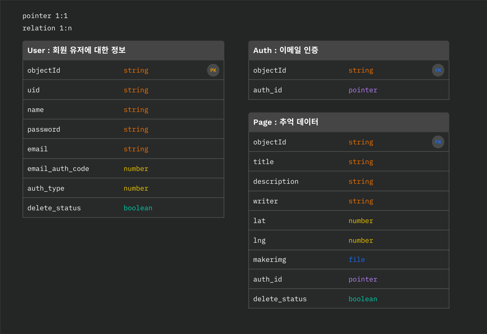

# 소개

추억지도 서버 입니다.

추억지도는 한 해를 기억하며 다양한 추억을 기록해 친구들과 공유하며 자랑 할 수 있습니다
참여율을 높이기위해 유저별 지도가 있으며 모든 추억을 볼수있는 지도도 있습니다.

## 🌿 기술 설명

추억지도 서버는 아래의 핵심 기술을 사용하여 만들어졌습니다.
자세한 패키지는 [package.json](./server/package.json)을 확인해주시면 감사하겠습니다.

### 핵심 기술

- Express.js
  - Parse-server
  - Parse-dashbaord
- PostgreSql

`Parse Server`는 Node.js를 실행할 수 있는 모든 인프라에 배포할 수 있는 오픈 소스 백엔드입니다.

phpmyadmin과 같은 DB를 관리할 수 있는 대시보드(`Parse Dashboard`)도 제공합니다.

## 📌 Server 설정

추억지도 서버는 `Ubuntu 18.04`서버에 `Docker-composer`에 의해 띄워져 운영 중 입니다.

[Nginx Proxy 서버](https://github.com/tjrehdrms123/TIL/blob/main/study/Liunx/Docker/Docker%EB%A5%BC%20%ED%86%B5%ED%95%B4%20Nginx%20proxy%EC%84%9C%EB%B2%84%20%EA%B5%AC%EC%B6%95.md)를 사용중에 있습니다.

## 🐾 ERD(DBeaver)

## 📑 사용 가능한 API

### [Api 명세서 보기](https://tjrehdrms123.github.io/mp-server/docs/index.html)

|  EndPoint   | Method |           detail            | done |
| :---------: | :----: | :-------------------------: | :--: |
| user/signup |  POST  |        유저 회원가입        |  ✅  |
| user/login  |  POST  |         유저 로그인         |  ✅  |
| auth/email  |  POST  |         이메일 인증         |  ✅  |
|    page     |  GET   |  추억 데이터 전체 가져오기  |  ✅  |
|  page/:id   |  POST  | 회원의 추억 데이터 가져오기 |  ✅  |
|    page     |  POST  |    추억 데이터 등록하기     |  ✅  |
|  page/:id   | PATCH  |    추억 데이터 수정하기     |  ✅  |
|    page     | PATCH  |    추억 데이터 수정하기     |  ✅  |
|  page/:id   | DELETE |    추억 데이터 삭제하기     |  ✅  |
|    test     |  POST  |         테스트 전용         |  ✅  |

## 2023.07 프로젝트 리뷰

### 📢 코드리뷰

1. 프로젝트르 완료 후 추가 기능을 추가할때 테스트 코드가 없어서 리팩토링 작업을할때 매우 불안하고 불편했다.
2. page.js pageListQuery메소드에서 유저에 해당하는 페이지를 조회하는데 `Full Table Scan`이 되었다.
3. 함수명을 봤을때 정확하게 동작을 추론할 수 없었다. 예시로 ID에 해당하는 유저를 조회하는 pageListQuery메소드가 있다 findPageById와 같이 변경하고싶다.
4. 2개 이상의 DB Connection을 연결해 작업하는 API에 Transaction코드가 존재하지 않는다.

### 📢 해결한 이슈 & 알게된 것

- [[마틴 파울러] 리팩토링의 중요성 feat.테스트 코드를 짜는 이유 정리](https://github.com/tjrehdrms123/TIL/blob/main/study/ETC/Refactoring/%5B%EB%A7%88%ED%8B%B4%20%ED%8C%8C%EC%9A%B8%EB%9F%AC%5D%20%EB%A6%AC%ED%8C%A9%ED%86%A0%EB%A7%81%EC%9D%98%20%EC%A4%91%EC%9A%94%EC%84%B1%20feat.%ED%85%8C%EC%8A%A4%ED%8A%B8%20%EC%BD%94%EB%93%9C%EB%A5%BC%20%EC%A7%9C%EB%8A%94%20%EC%9D%B4%EC%9C%A0%20%EC%A0%95%EB%A6%AC.md)
- [크롤링(스크래핑)하기](<https://github.com/tjrehdrms123/TIL/blob/main/study/JS/Node.js/Utility/%ED%81%AC%EB%A1%A4%EB%A7%81(%EC%8A%A4%ED%81%AC%EB%9E%98%ED%95%91)%ED%95%98%EA%B8%B0.md>)
- [mysql2 with “Too many connections”](https://github.com/tjrehdrms123/TIL/blob/main/study/JS/Node.js/Error/mysql2%20with%20%E2%80%9CToo%20many%20connections%E2%80%9D.md)
- [[ FSFilesAdapter ]Parse Error: spawn ps ENOENT에러](https://github.com/tjrehdrms123/TIL/blob/main/study/JS/Node.js/PM2/Error/%5B%20FSFilesAdapter%20%5DParse%20Error%20spawn%20ps%20ENOENT.md)
- [CORS header contains multiple values](https://github.com/tjrehdrms123/TIL/blob/main/study/JS/Node.js/Error/CORS%20header%20contains%20multiple%20values.md)
- server.js 응답 미들웨어
  - 응답 상태 객체를 만들고 상태에 따라 message에 값을 다르게 넣어서 재사용성을 증가시켜서 사용하려고했을때 발견했던 이슈이다.
    로그인을 했을떄 "refreshToken", "sameSite" 등 message외 추가적인 값을 프로퍼티에 추가해 넘겨줬다.
    하지만 하나의 객체를 override해서 사용할 경우 다음 요청에 message만 바꾸고 이전 요청에 있던 "refreshToken", "sameSite"등 필요하지 않은 프로퍼티의 값을 제거하지 않으면, 이전 값을 그대로 반환한다.
    그래서 응답 미들웨어에 타입을 추가해서 타입이 "cookie" 즉 로그인이면 반환하는 코드를 하나 더 추가했다.
